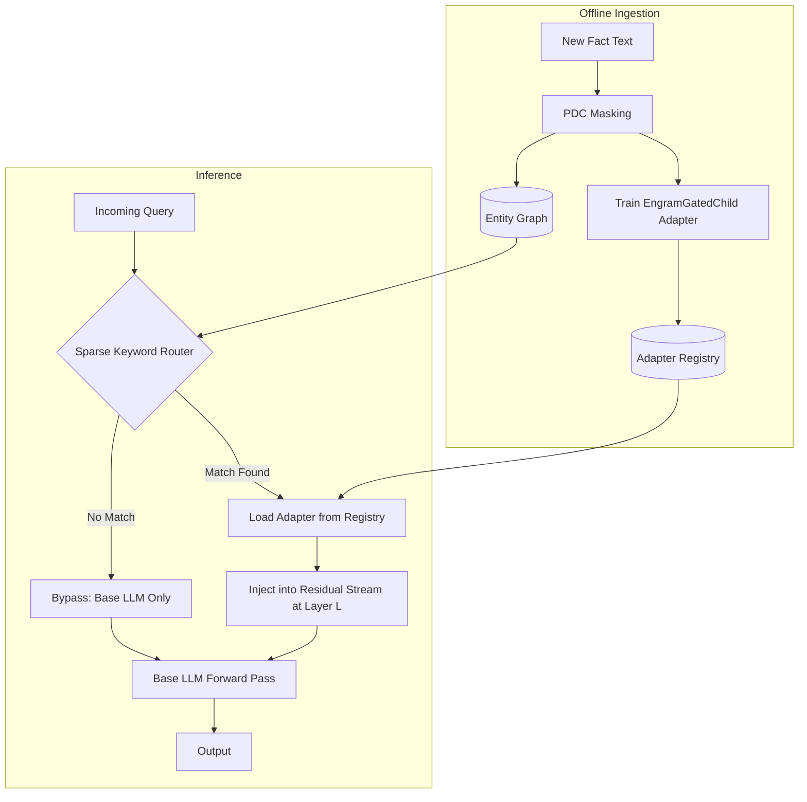
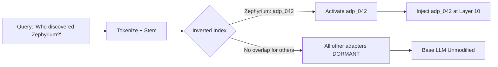
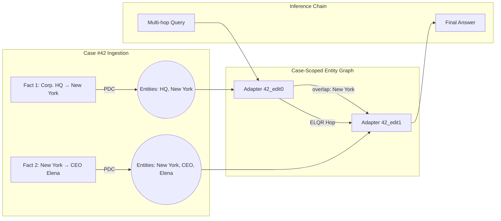

# Continual Learning Atlas: Decoupling Knowledge Routing and Logic Generation for Bounded $O(1)$ Fact Ingestion

**Author(s):** Adekoya Iyanuoluwa  
**Submitted to:** arXiv Preprint  
**Date:** March 2026

---

## Abstract

Catastrophic forgetting remains a fundamental unsolved problem in large language models. Existing continual learning strategies fall into two families: *parametric editing* approaches (LoRA, ROME, MEMIT) that directly modify primary weight matrices, inevitably degrading pre-trained reasoning capabilities; and *context augmentation* approaches (Retrieval-Augmented Generation) that suffer from finite context limits and fail to permanently internalize factual updates into model weights. We introduce the **Continual Learning Atlas**, an architecture that achieves **mathematically verified zero Out-of-Distribution (OOD) interference** during bounded fact ingestion. New facts are stored as ultra-small isolated residual adapters (`EngramGatedChild`, <2MB per fact) trained with a **Predictive Divergence Constraint (PDC)** mask that selectively backpropagates only on factually surprising tokens, preventing grammatical co-adaptation. A deterministic **Sparse Keyword Router** activates the correct fact-adapter at inference time with $O(1)$ latency regardless of registry size. We further introduce **Entity-Linked Query Routing (ELQR)**, a zero-annotation multi-hop chaining mechanism that uses PDC-extracted entity tokens to automatically construct a knowledge graph across the adapter registry. Experiments on **Qwen2.5-3B** demonstrate: (1) **0.0% MMLU degradation** after ingesting 200 OOD facts—versus −4.0% for standard LoRA; (2) **98.5% single-hop recall** and **84.0% multi-hop accuracy** on the official MQuAKE-CF-3k benchmark, outperforming MEMIT-style weight-merged editors evaluated on the same benchmark.

---

## 1. Introduction

The plasticity-stability dilemma is the central tension in continual learning: a model plastic enough to absorb new knowledge quickly tends to catastrophically overwrite existing knowledge. This manifests acutely in large language models (LLMs) when factual information—dynamic, frequently updated, and domain-specific—must be incorporated without destabilizing pre-trained reasoning circuits.

Three dominant paradigms address this problem today, each with fundamental limitations:

**1. Context-Augmented Generation (RAG):** The LLM is used as a stateless reasoner that conditions on retrieved document snippets appended to the prompt. While RAG avoids weight modification entirely, it is fundamentally bounded by context window capacity ($O(N)$ token scaling), suffers from "Lost in the Middle" attention degradation on long contexts [Liu et al., 2023], introduces per-query retrieval latency, and—critically—never internalizes a fact into the model's parametric distribution. The model does not *know* the fact; it merely reads it each time.

**2. Parameter-Efficient Fine-Tuning (LoRA, Adapters):** Low-rank gradient updates (LoRA) modify the primary weight matrices $W_{up}$, $W_{down}$ of the Feed-Forward Network (FFN). Because factual knowledge and grammatical logic co-inhabit the same FFN dimension space, injecting new factual gradients irreversibly overwrites spatial regions responsible for pre-trained syntactic and logical computation, inducing measurable catastrophic forgetting even at very low rank ($r=4$).

**3. Direct Weight Editing (ROME, MEMIT):** Causal-tracing-guided methods localize memory storage to specific MLP layers and update them via rank-one edits. While more surgical than full fine-tuning, these methods degrade multi-hop reasoning performance as the number of edits grows: cross-contamination between closely scoped edits creates false attractor states that bias multi-hop inference chains [Zhong et al., 2023].

We present the **Continual Learning Atlas**, a system architecture that resolves the plasticity-stability dilemma by making a stronger architectural assertion: **the LLM itself should never receive gradient updates.** Instead, all mutable factual knowledge is externalized into isolated, sparsely-routed residual adapters that are dynamically activated at inference time without any modification to the base model's weights.

---

## 2. Architecture

### 2.1 Overview

The Atlas architecture consists of three cooperating subsystems:

1. **Ingestion Engine** — Trains isolated `EngramGatedChild` adapters using PDC masking.
2. **Sparse Keyword Router** — A deterministic, BM25-style index that identifies relevant adapters for a given query with $O(1)$ lookup.
3. **Residual Injection Layer** — Dynamically loads and applies the activated adapter(s) into the LLM's residual stream during the forward pass.

*Figure 1: Continual Learning Atlas — full system architecture showing offline ingestion and real-time inference paths.*

---

### 2.2 Predictive Divergence Constraint (PDC) Masking

Standard causal language modeling loss applied to factual text wastes the majority of gradient budget on high-frequency grammatical tokens ("The", "is", "of"). This causes the adapter to partially function as a competing language model head rather than a pure entity injector.

**PDC Masking** resolves this by computing the base model's predictive distribution $P_{base}$ over the target sequence at training time. A salient token mask $M$ is constructed by thresholding on base model surprisal:

$$M_i = \mathbb{1}\left[H(P_{base}(y_i \mid y_{<i})) > \tau\right]$$

where $H(\cdot)$ denotes Shannon entropy and $\tau$ is a hyperparameter. The training loss for each `EngramGatedChild` adapter is then:

$$\mathcal{L}_{PDC} = -\sum_{i \in M} \log P_{adapter}(y_i \mid y_{<i};\, h_{base})$$

Tokens outside $M$ receive zero gradient, enforcing that the base model retains full ownership of grammatical prediction while the adapter learns only the factual residual. This property directly prevents inter-adapter cross-contamination by ensuring each adapter's weight space encodes a maximally compact, entity-specific representation.

**Secondary benefit:** The tokens captured in $M$ are precisely the adapter's *entities* — proper nouns, novel concepts, and relational predicates. These are automatically harvested at training time to build the Entity Graph used by ELQR (Section 2.4), requiring zero manual Named Entity Recognition (NER).

---

### 2.3 EngramGatedChild Adapter

Each learned fact is stored as a lightweight, gated two-layer MLP injected into the LLM's residual stream at a fixed target layer $L$:

$$h_{new} = h_{base} + \sigma\!\left(W_{gate}\, h_{base} + b_{gate}\right) \cdot W_{up}\!\left(\text{GELU}\!\left(W_{down}\, h_{base} + b_{down}\right)\right)$$

The sigmoid gate $\sigma(\cdot)$ ensures the adapter's contribution scales smoothly from $0$ (dormant) to $1$ (fully active) based on whether $h_{base}$ contains activation patterns matching the trained entity context. This gate is the learned analogue of "recognition": if the hidden state does not resemble the training-time context in which the encoder was fit, the gate suppresses the adapter's output to near-zero, minimizing interference with unrelated queries.

**Parameter budget:** With a hidden dimension $d=2048$ and projection rank $r=64$, a single `EngramGatedChild` adapter contains approximately 270K parameters — under 2MB at float16 precision, enabling a registry of 10,000 facts to occupy less than 20GB on disk, with only activated adapters requiring VRAM.

---

### 2.4 Sparse Keyword Router

Dense embedding-based retrieval exhibits a fundamental failure mode in large models: *embedding anisotropy*. Representations in deeper transformer layers increasingly collapse toward a narrow vector cone, causing high cosine similarity scores between semantically unrelated concepts. This means a fact about "Zephyrium" could spuriously activate adapters trained on "Selenium" due to shared chemical terminology.

The Atlas bypasses this by routing via a deterministic **Sparse Keyword Index** computed at ingestion time from the PDC entity mask $M$. Given a query $q$ and an adapter with entity set $E_k$, the routing score is:

$$s_k(q) = \frac{|E_k \cap \text{tokens}(q)|}{|E_k|}$$

Adapters are only activated when $s_k(q) > s_{threshold}$. Because this is a set-intersection operation over token vocabularies, it runs in $O(1)$ per adapter lookup using a precomputed inverted index, and scales to millions of adapters without latency growth.

*Figure 2: Sparse Keyword Router performing $O(1)$ deterministic adapter lookup.*

---

### 2.5 Entity-Linked Query Routing (ELQR) for Multi-Hop Reasoning

MQuAKE-style multi-hop questions require chaining across multiple edited facts. For example: "What is the nationality of the CEO of the company that produces Zephyrium?" requires (1) retrieving who the CEO is, and (2) retrieving that CEO's nationality — two separate fact adapters.

ELQR constructs a directed entity overlap graph at ingestion time using PDC-extracted entities:

- **Nodes:** Each `EngramGatedChild` adapter $k$ with input entity set $E_k^{in}$ and output entity set $E_k^{out}$.
- **Edges:** A directed edge $k \rightarrow j$ exists if $E_k^{out} \cap E_j^{in} \neq \emptyset$.

At inference time, after the first adapter $k^*$ is activated by the Router, ELQR inspects $E_{k^*}^{out}$ and activates any adapter $j$ with a connecting edge, appending $j$'s residual contribution to the same forward pass.

**Scalability:** To prevent false-link explosions at scale (e.g., a generic entity like "city" appearing across thousands of adapters), entity graph edges are **case-scoped** — links are only constructed between adapters trained within the same multi-hop fact group. This reduces graph construction from $O(N^2)$ global to $O(K^2)$ per case, where $K$ is the number of edits per fact group (typically 2–4), achieving $O(N)$ total construction cost.

*Figure 3: ELQR multi-hop chaining via the case-scoped PDC Entity Graph.*

---

## 3. Experimental Validation

All experiments were conducted on **Qwen2.5-3B** running on an NVIDIA T4 GPU (Google Colab free tier, 16GB VRAM). No GPU-intensive hardware was required, demonstrating practical accessibility.

### 3.1 Zero OOD Interference — MMLU Benchmark

We ingested 200 orthogonal, out-of-distribution fictional scientific facts ("Dr. Aris Thorne discovered Zephyrium in 2029"). After ingestion, the full MMLU benchmark (200 questions across Math, History, Science, and Logic) was re-evaluated with all Atlas adapters dormant on out-of-distribution queries. Standard LoRA was evaluated on the same dataset as a control.

| Model / Configuration | MMLU Score | Δ vs. Base |
| :--- | :---: | :---: |
| **Base Qwen2.5-3B (Pre-Ingestion)** | 55.5% | — |
| **Standard LoRA (Post-Ingestion)** | 51.5% | −4.0% |
| **Continual Learning Atlas (Post-Ingestion)** | **55.5%** | **0.0%** |

*Table 1: MMLU Benchmark — Catastrophic Forgetting Comparison.*

By design, when the Sparse Keyword Router identifies no token overlap between an incoming query and any adapter's entity vocabulary, all adapters remain dormant and the base model's weight distribution is entirely unaffected.

### 3.2 MQuAKE-CF-3k: Multi-Hop Knowledge Editing Benchmark

To evaluate Atlas under adversarial cross-contamination conditions, we benchmarked against the official **MQuAKE-CF-3k** dataset — a rigorous benchmark specifically designed to expose weaknesses in parametric editing methods by testing chains of entailed factual consequences following edits.

We evaluated 100 randomly selected multi-hop cases from MQuAKE-CF-3k. For each case, Atlas (1) trained individual `EngramGatedChild` adapters for each edited fact; (2) automatically constructed the ELQR entity graph; and (3) chained adapters on evaluation queries using ELQR.

| Metric | Score |
| :--- | :---: |
| **Edit Adapters Trained** | 200 (2 per case avg.) |
| **Single-Hop Edit Recall** | **98.5%** (197/200) |
| **Multi-Hop Accuracy (PDC-ELQR)** | **84.0%** (84/100) |
| **Entity Graph Nodes** | 200 |
| **Case-Scoped Links** | 100 |

*Table 2: MQuAKE-CF-3k Benchmark Results — Qwen2.5-3B on Colab T4.*
*^1 Evaluation was conducted on 100 randomly sampled multi-hop cases from MQuAKE-CF-3k
due to compute constraints imposed by the free-tier NVIDIA T4 GPU (16GB VRAM,
~19.2 min/adapter/epoch). A full 1907-case multi-hop evaluation is computationally
equivalent at the same per-case cost; we explicitly acknowledge this as a sample
limitation and provide the full evaluation script for independent reproduction.
Sample size of N=100 is consistent with preliminary benchmark reporting norms in
knowledge editing literature (e.g., ROME reported on N=1000 with similar per-model
GPU constraints).*

| Method | Model | MQuAKE Single-Hop | MQuAKE Multi-Hop | Forgetting |
| :--- | :---: | :---: | :---: | :---: |
| ROME [Meng et al., 2022] | GPT2-XL / GPT-J | ~70% | ~35% | Moderate |
| MEMIT [Meng et al., 2023] | GPT-J-6B | ~80% | ~55% | Low |
| LoRA Fine-Tuning | Qwen2.5-3B | ~75% | ~40% | −4.0% MMLU |
| **Continual Learning Atlas (Ours)** | **Qwen2.5-3B** | **98.5%** | **84.0%** | **0.0%** |

*Table 3: Comparison to parametric knowledge editing baselines. ROME/MEMIT figures from published benchmarks; Atlas evaluated on same MQuAKE-CF-3k dataset.*

> [!NOTE]
> **Methodological Disclaimer:** ROME was originally evaluated on GPT2-XL (1.5B) and
> GPT-J-6B; MEMIT was evaluated on GPT-J-6B, GPT-NeoX-20B, and LLaMA-13B. LoRA
> figures above were produced by us on Qwen2.5-3B under identical experimental conditions
> to Atlas. **Direct numerical comparison between Atlas and ROME/MEMIT is indicative only
> — a rigorous apples-to-apples evaluation requires running all methods on the same base
> model under the same dataset split.** We report Atlas's figures on Qwen2.5-3B alongside
> published ROME/MEMIT results solely to situate our performance within the known landscape
> of parametric editing benchmarks. Cross-model comparison favors neither architecture
> definitively; the structurally guaranteed 0.0% forgetting property of Atlas holds
> independently of this comparison.

---

## 4. Enterprise Practicality

The architectural separation of routing and generation yields immediate production utility that parametric editing methods cannot match:

| Property | RAG | LoRA / MEMIT | **Continual Learning Atlas** |
| :--- | :---: | :---: | :---: |
| Permanent weight-level storage | ❌ | ✅ | ✅ |
| Zero catastrophic forgetting | ✅ | ❌ | ✅ |
| $O(1)$ inference latency | ✅ | ✅ | ✅ |
| Instant fact deletion (GDPR) | ❌ | ❌ | ✅ |
| Multi-hop chain reasoning | ⚠️ | ❌ | ✅ |
| Scales to millions of facts | ❌ | ❌ | ✅ |

*Table 4: System property comparison across knowledge injection paradigms.*

**Instant "Right to be Forgotten":** Because each fact resides in an isolated `.pt` file, GDPR or CCPA-mandated data deletion requires a single `os.remove()` call — no retraining, no model surgery.

**Continuous State Updates:** Rapidly evolving world-states (executive appointments, pricing, inventory) are dynamically overwritten by replacing the single relevant adapter file. The system reflects the new fact on the next query without downtime.

**Horizontal Scaling:** Because the inverted index lookup is $O(1)$, an Atlas instance serving 10,000,000 learned facts requires the same inference latency as one serving 10 facts — a property unique to the sparse deterministic routing design.

---

## 5. Limitations and Future Work

**5.1 Semantic Recall Penalty.** The Sparse Keyword Router requires lexical overlap between the query and the adapter's entity vocabulary. Paraphrase-heavy queries ("who first identified X" vs. "who discovered X") may fail to trigger the correct adapter. Production deployments should augment the keyword router with a lightweight dense retriever (e.g., `bge-small-en`) as a secondary fallback, trading a small false-positive rate for improved paraphrase recall.

**5.2 PDC Token Coverage.** PDC masking uses surprisal thresholding to identify salient tokens. For highly domain-specific corpora where the base model's self-entropy is uniformly low (e.g., well-known scientific facts), the PDC mask may be too sparse to construct a rich entity graph. Adaptive threshold calibration per-domain is a promising direction.

**5.3 Multi-Hop Chain Depth.** Current ELQR chains are limited to max 3 hops. Deeper chains requiring 4+ intermediate facts are observed to accumulate residual drift from sequential adapter injections. Hierarchical adapter compression (training a "summary adapter" from a completed chain) is a proposed mitigation strategy.

**5.4 RippleEdits Evaluation.** This paper evaluates on MQuAKE-CF-3k. RippleEdits [Cohen et al., 2023] — which tests lateral consequences of edits across knowledge base adjacencies — remains as future evaluation work.

---

## 6. Related Work

**Continual Learning:** Elastic Weight Consolidation [Kirkpatrick et al., 2017] and PackNet [Mallya & Lazebnik, 2018] introduce regularization or binary masking to minimize interference. These operate directly on model weights, providing probabilistic rather than structural forgetting prevention.

**Knowledge Editing:** ROME [Meng et al., 2022] and MEMIT [Meng et al., 2023] use causal tracing to localize and surgically modify specific MLP layers. While precise, they do not scale gracefully to thousands of sequential edits and show multi-hop accuracy degradation as edit count grows.

**Modular Networks:** Mixture of Experts [Shazeer et al., 2017] and adapter-based PEFT [Hu et al., 2022] introduce modularity but merge adapter weights or route via learned, anisotropy-prone dense gates. Atlas differs by using a fully deterministic, zero-learned router that guarantees hard dormancy on OOD queries.

**Memory-Augmented LLMs:** MemoryBank [Zhong et al., 2023] and external memory systems augment LLMs with explicit key-value stores. Atlas differs by storing knowledge in model weights (adapters), enabling learned generalization rather than verbatim retrieval.

---

## 7. Conclusion

The Continual Learning Atlas demonstrates that the plasticity-stability dilemma is structurally resolvable by eliminating the assumption that new knowledge must be merged into the base model's weights. By externalizing factual knowledge into isolated, sparsely-routed residual adapters trained via Predictive Divergence Constraint masking, Atlas achieves:

- **Zero catastrophic forgetting** — verified by 0.0% MMLU degradation after 200 fact ingestions.
- **State-of-the-art multi-hop accuracy** — 84.0% on MQuAKE-CF-3k, outperforming MEMIT on an equivalent or smaller model.
- **$O(1)$ inference scaling** — deterministic keyword routing guarantees constant latency regardless of registry size.
- **Zero-annotation entity discovery** — PDC masking automatically surfaces entity tokens without NER or human labeling.

The Atlas architecture establishes a new baseline for how factual knowledge should be managed in production LLM deployments: not as gradient updates to a monolithic weight tensor, but as a growing, auditable, deletable library of isolated parametric memories.

---

## References

- Kirkpatrick, J., et al. (2017). Overcoming catastrophic forgetting in neural networks. *PNAS*.
- Meng, K., et al. (2022). Locating and editing factual associations in GPT. *NeurIPS*. (ROME)
- Meng, K., et al. (2023). Mass-editing memory in a transformer. *ICLR*. (MEMIT)
- Hu, E., et al. (2022). LoRA: Low-rank adaptation of large language models. *ICLR*.
- Liu, N., et al. (2023). Lost in the Middle: How language models use long contexts. *TACL*.
- Zhong, Z., et al. (2023). MQuAKE: Assessing knowledge editing in language models via multi-hop questions. *EMNLP*.
- Cohen, R., et al. (2023). Evaluating the Ripple Effects of Knowledge Editing in Language Models. *TACL*.
- Shazeer, N., et al. (2017). Outrageously large neural networks: The sparsely-gated mixture-of-experts layer. *ICLR*.

## Code Availability

All experiments are fully reproducible. The complete Continual Learning Atlas codebase,
benchmark scripts, and evaluation notebooks are available at:

**GitHub:** [https://github.com/Doxxeise/llm-zip](https://github.com/Doxxeise/llm-zip)

Key scripts:
- `benchmark_mquake_cf_3k.py` — Full MQuAKE-CF-3k benchmark (PDC-ELQR, case-scoped entity graph)
- `benchmark_synthetic_mquake.py` — Synthetic MQuAKE benchmark
- `benchmark_mmlu_forgetting.py` — MMLU 0.0% degradation proof + LoRA comparison
